# System Explainer

The complete description of this system: every requirement from the brief, the solution built
for it, and why that solution is necessary — stated as what breaks without it.

This is the single reference document. Backend concepts are explained where they first appear.

| | |
|---|---|
| §A | Running it |
| §B | Tech stack |
| §0–2 | What it does, the assignment engine, selection |
| §3–4 | Concurrency, recompute |
| §5–6 | APIs, background processing |
| §7–9 | Performance, auth, data model |
| §10–11 | Exclusions, verification |
| §12–15 | Consistency, assumptions, requirement traceability, evidence |

---

## A. Running it

```bash
docker compose up --build
```

| | |
|---|---|
| UI | http://localhost:5173 |
| API docs (Swagger) | http://localhost:8000/docs |
| OpenAPI schema | http://localhost:8000/schema |

Logins after seeding: `manager` / `manager`, `admin` / `admin`, or any `userNNNN` / `demo`.

Without Docker, against a local PostgreSQL:

```bash
python -m venv .venv && .venv/bin/pip install -r requirements.txt
createdb taskassign
POSTGRES_HOST=/tmp POSTGRES_PORT=5432 .venv/bin/python manage.py migrate
.venv/bin/python manage.py seed --users 200 --rules 8 --tasks 50
.venv/bin/python manage.py test assignment
```

Celery runs jobs inline unless `CELERY_EAGER=0`, so the test suite and a bare `runserver`
exercise the whole assignment path without a broker.

**Seeding at benchmark scale**, parameterised on the two quantities the design is sensitive
to — the number of distinct rules, and how many users each matches:

```bash
.venv/bin/python manage.py seed_scale --users 100000 --tasks 1000000 --rules 1000
.venv/bin/python manage.py benchmark --iterations 400 --workers 8
```

> Every credential in this repository is a deliberate placeholder. `SECRET_KEY` defaults to
> `dev-only-not-for-production`, the Postgres password never leaves the compose network, and
> all are environment-overridable. §13 lists the security simplifications.

---

## B. Tech stack

| Asked for | Used | Why |
|---|---|---|
| Python — Django or FastAPI | Django 4.2 + DRF | The work is model-heavy: migrations, a custom user model, an ORM for the majority of queries that are ordinary. FastAPI would mean assembling those separately, for no gain on the part that is actually hard — SQL that neither framework writes for you |
| PostgreSQL | PostgreSQL 14 | Partial indexes, `RETURNING`, and mixed ASC/DESC composite indexes are all load-bearing here. The design does not port unchanged to MySQL |
| Redis — caching and queues | Both | Celery broker, rule cache, single-flight lock, recompute debounce |
| Celery / RQ / worker | Celery, beat in the same process | The two periodic jobs are low-frequency safety nets, not throughput work; a separate container would add operational surface for nothing |
| JWT + refresh tokens | SimpleJWT | The UI refreshes once transparently on a 401, then stops rather than looping |
| React | React 18 + Vite | Two screens; see §10 |
| Docker and Docker Compose | Five services, verified running | §11 |

---

## 0. What the system does

A task carries a **rule** describing who may do it. No one selects an assignee. The system
computes which users satisfy the rule and assigns the task automatically.

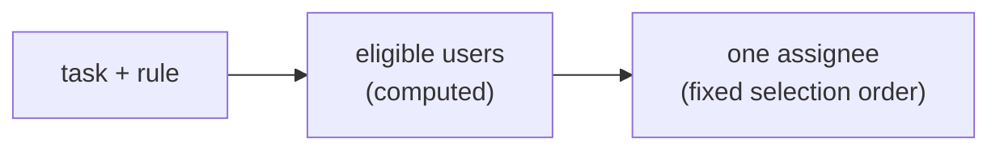

Scale: 100,000 users, 1,000,000 tasks.

### Components

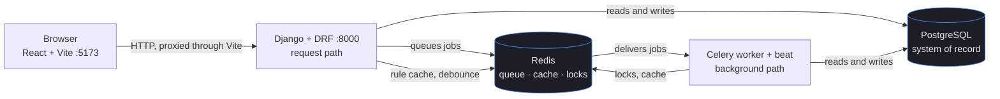

The split between the two paths is the load-bearing part: **no assignment decision is ever
made on the request path.** The web process saves a task and queues work; the worker decides
who gets it.

---

## 1. Assignment engine

### 1.1 Eligibility storage

**Requirement.** Each task defines rules. The system computes eligible users.

**Solution.** Eligibility is stored per **rule**, not per task. Rules are normalised into a
canonical form, hashed with SHA-256, and the hash is the rule's identity. Two tasks whose
rules produce the same hash share one stored eligible set.

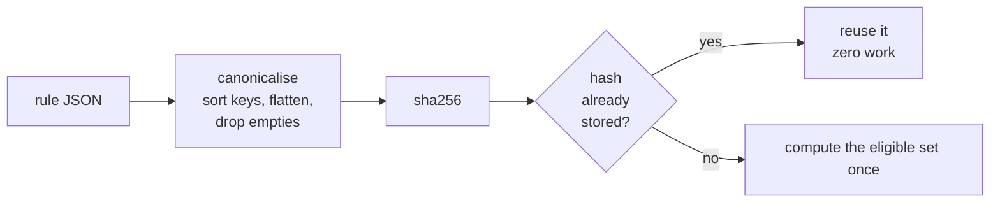

The difference the hash makes:

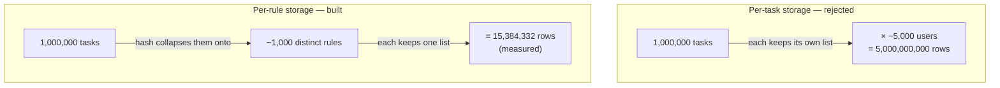

**Why needed.** Storing eligibility per task means:

```
rows = tasks × eligible users per task
     = 1,000,000 × ~5,000
     = 5,000,000,000
```

That is hundreds of gigabytes, and it must be updated whenever any user changes. Storing per
rule gives:

```
rows = rules × eligible users per rule
```

The ratio between the two is `tasks / rules`. Measured on seeded data: **1000:1**.

The saving does not depend on how selective rules are — selectivity and user count appear in
both expressions and cancel.

### 1.2 Canonicalisation

**Requirement.** Identical rules must be recognised as identical.

**Solution.** Before hashing: sort keys, flatten single-element lists, drop empty and null
predicates, coerce numeric types.

**Why needed.** `{"department": "Finance"}` and `{"department": "Finance", "location": ""}`
express the same rule. Without normalisation they hash differently, so they are stored twice.
Nothing fails visibly — the system simply drifts back toward per-task storage and gets slower.
Canonicalisation is what makes deduplication reliable rather than accidental.

### 1.3 Stable and volatile predicates

**Requirement.** Rules combine department, experience, location, and active task count.

**Solution.** Predicates are split by how often they change.

| Predicate | Changes when | Handling |
|---|---|---|
| Department | HR event | Stored (materialised) |
| Experience | HR event | Stored |
| Location | HR event | Stored |
| Active task count | Every assignment and completion | **Not stored.** Applied as a live filter at query time |

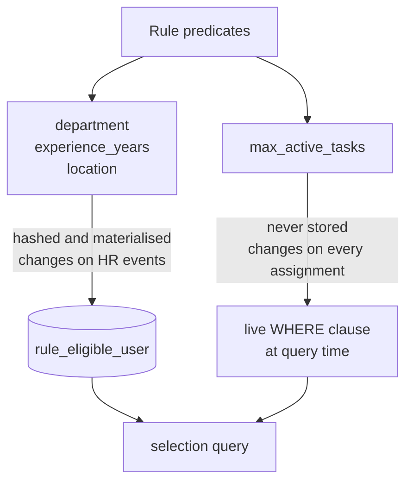

**Why needed.** `active_tasks < 5` changes on every assignment. If it were part of stored
eligibility, one assignment would invalidate every stored set containing that user. At the
stated scale the system would spend all its time recomputing.

Splitting means the fastest-changing field produces no background work at all.

### 1.4 Rule immutability

**Requirement.** Admin updates a task's rules (Story 4).

**Solution.** Rule rows are never modified. Changing a task's rule points it at a different
rule row, creating that row only if its hash is new.

**Why needed.** If rules were mutable, editing one would invalidate the stored eligibility of
every task referencing it — cost proportional to task count. As a pointer swap, the cost is:

```
hash already exists  → no recomputation
hash is new          → one indexed scan of the users table
```

Neither depends on how many tasks use the rule.

### 1.5 Two evaluators

**Requirement.** Evaluate rules against users.

**Solution.** Two functions over the same canonical JSON:

```python
to_sql(predicates)        -> (where_clause, params)   # one rule → all users
matches(predicates, user) -> bool                     # one user → all rules
```

**Why needed.** The two directions have opposite shapes:

```
materialising a rule:      1 rule  vs 100,000 users  → belongs in the database
a user's attributes change: 1 user vs   1,000 rules  → belongs in memory
```

One shared implementation would either load 100,000 users into Python, or issue 1,000 database
queries per profile edit.

Two implementations can diverge, so a property test asserts they select identical user sets
across a generated space of rules.

### 1.6 No rule language

**Requirement.** Rules are dynamic.

**Solution.** A rule is a flat AND of at most four optional predicates, each single-valued.
No nesting, no OR, no NOT.

**Why needed.** Two reasons.

1. The attribute set is closed — four fields. A general expression language requires a grammar,
   parser, syntax tree, evaluator, and a safety story, to express what fits in a struct.
2. Arbitrary expressions have unbounded variety. Rules would stop repeating, deduplication
   (§1.1) would stop working, and the design's leverage would disappear.

Multi-valued predicates are rejected rather than truncated: a rule that silently dropped a
department would route work to the wrong team with no error to observe.

---

## 2. Selection

### 2.1 Multiple eligible users

**Requirement.** "What will happen if there are multiple eligible users?"

**Solution.** A four-key ordering. The first row is the assignee.

```sql
ORDER BY committed_effort_hours ASC,   -- 1. least current load, in hours
         lifetime_hours         DESC,  -- 2. most work delivered historically
         date_joined            ASC,   -- 3. older account
         id                     ASC    -- 4. unique tiebreaker
```

**Why each key is needed.**

**Key 1 — least current load.** The rules themselves constrain load (`active_tasks < 5`).
Optimising the same quantity the rules constrain keeps users away from their cap, which
reduces how often tasks become unassignable.

Measured in **hours**, not task count, because count treats one 8-hour task as equal to four
30-minute tasks. Without effort, "least loaded" does not correspond to actual workload.

**Key 2 — lifetime hours, descending.** Breaks ties between equally-loaded users. Keys 1 and 2
point in opposite directions by design: least current burden, most historical delivery.

**Key 3 — account age.** Breaks ties where load and history are both equal.

**Key 4 — user id.** Account timestamps are not unique; a bulk import writes many identical
values. Without a unique final key the ordering is not total, so tied rows are returned in
database-chosen order. Consequences: results are not reproducible, and in practice the same
user is returned repeatedly.

Measured on seeded data: **17 users tied on keys 1–3**. Key 4 decides between them.

**Alternative considered.** A single-key ordering was measured against the four-key ladder:
24.7 ms versus 31.8 ms, a 7 ms difference on a query whose cost lay in the join plan rather
than the ordering. The additional keys cost nothing measurable, so all four are retained.

### 2.2 No eligible users

**Requirement.** "What will happen if there are no eligible users?"

**Solution.** The task is created and left unassigned in a pool. It is never rejected. Three
states are reported distinctly:

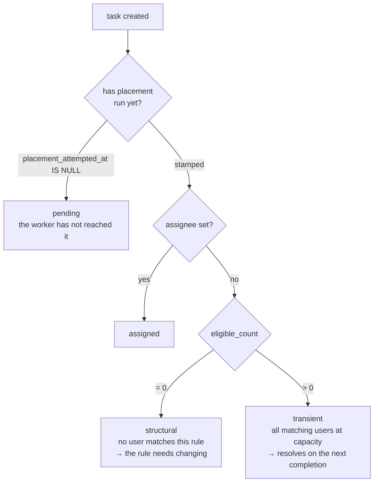

**Why needed.**

*Why not reject:* a rule matching nobody today may match tomorrow — a new hire joins, an
assignee finishes work. Rejecting at creation forces the creator to poll and retry manually.

*Why three states, not two:* structural and transient failures require opposite responses —
fix the rule, versus wait. Reporting one message for both leaves the creator unable to tell a
mistake from normal contention.

*Why "pending" exists:* assignment runs in a background worker, so at the moment the API
responds, the outcome does not yet exist. A `placement_attempted_at` timestamp on the task
records whether placement has run, making the distinction a stored fact rather than a guess.

### 2.3 Task selection order

**Requirement.** Tasks have priority.

**Solution.** When capacity frees, pooled tasks are taken in this order:

```sql
ORDER BY priority ASC,      -- 0 = P0, highest
         created_at ASC     -- oldest first within a priority band
```

**Why needed.** Priority alone is not a total order. Without a second key, a task can be
passed over indefinitely while newer tasks of equal priority are chosen ahead of it.
`created_at` makes each priority band a queue with bounded waiting time.

`priority` is stored as an integer, not text. Text sorts alphabetically, so `'P10'` sorts
before `'P2'` — incorrect as soon as priorities exceed single digits.

**Priority does not preempt.** A P0 arriving when all users are at capacity waits like any
other task and takes the next freed slot. It does not displace work in progress.

### 2.4 Single assignment path

**Requirement.** Higher-priority tasks are assigned first.

**Solution.** Exactly one function assigns tasks:

```
fill_capacity(user):
    while the user is under their cap:
        take the highest-ranked pooled task the user is eligible for
        claim it; stop when nothing fits
```

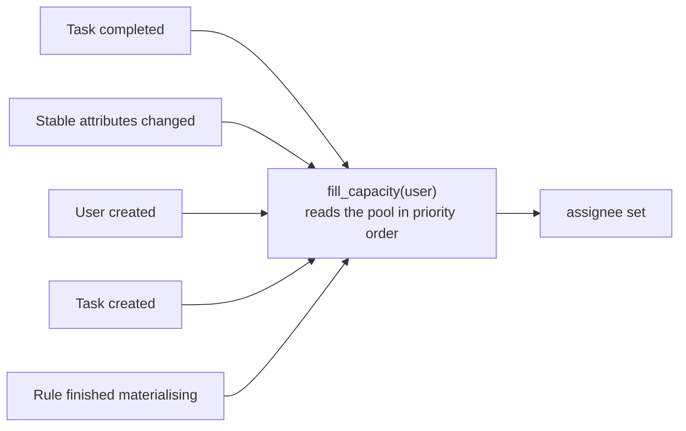

Five events call it:

| Event | Why it can change the outcome |
|---|---|
| Task completed | A capacity slot freed |
| User's stable attributes changed | The user may now satisfy more rules |
| User created | A new candidate exists |
| Task created | Its rule's best candidate is asked to fill |
| Rule finished materialising | Its eligible set went from empty to populated |

**Why needed.** With two assignment paths — a direct assign on creation, plus a pool drain on
completion — the priority guarantee fails:

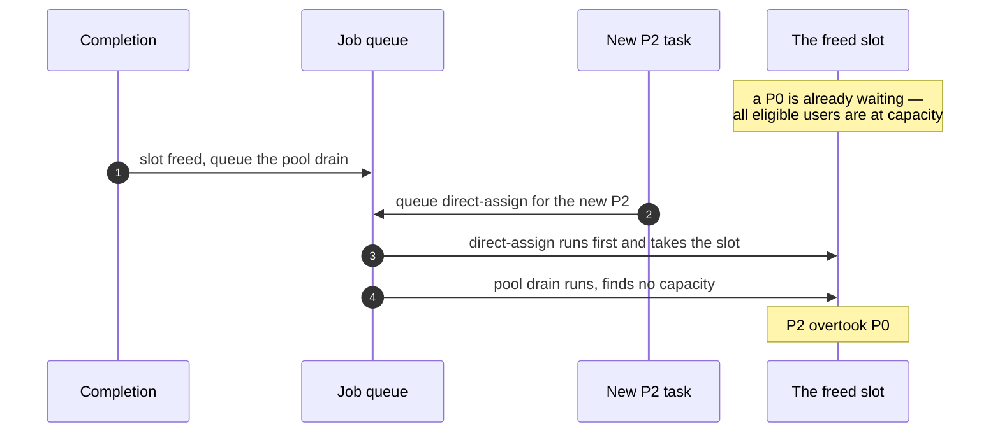

The direct path does not consult the pool, so it cannot know a higher-priority task is already
waiting. Routing every event through one function that always reads the pool in priority order
makes the guarantee structural rather than dependent on job execution order.

---

## 3. Concurrency

**Requirement.** Assignment must respect `active_tasks < N`.

**Solution.** The capacity check is inside the write:

```sql
UPDATE users
   SET active_task_count      = active_task_count + 1,
       committed_effort_hours = committed_effort_hours + %(effort)s
 WHERE id = %(user_id)s
   AND active_task_count < %(cap)s
RETURNING id;
```

Zero rows returned means another worker took the slot; the caller tries the next candidate.

**Why needed.** Reading a value, deciding, then writing is three separate operations. Another
process can act between them:

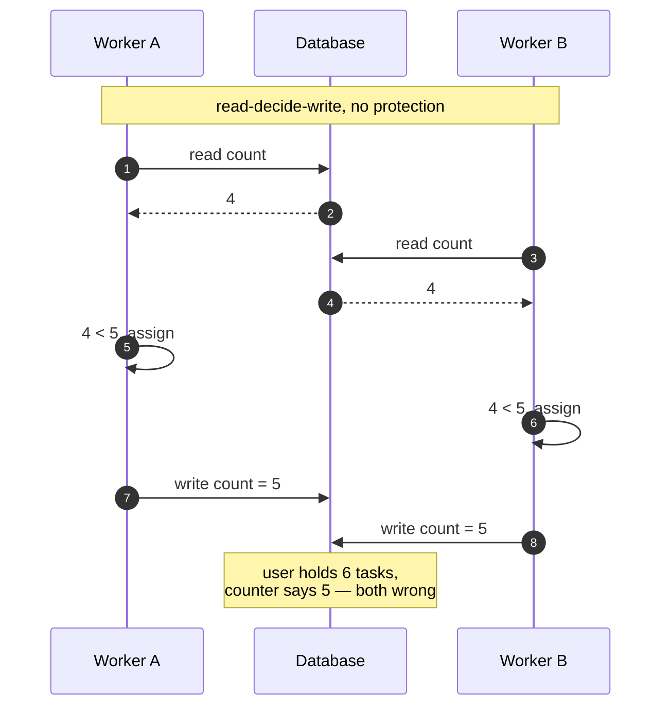

With the check inside the write:

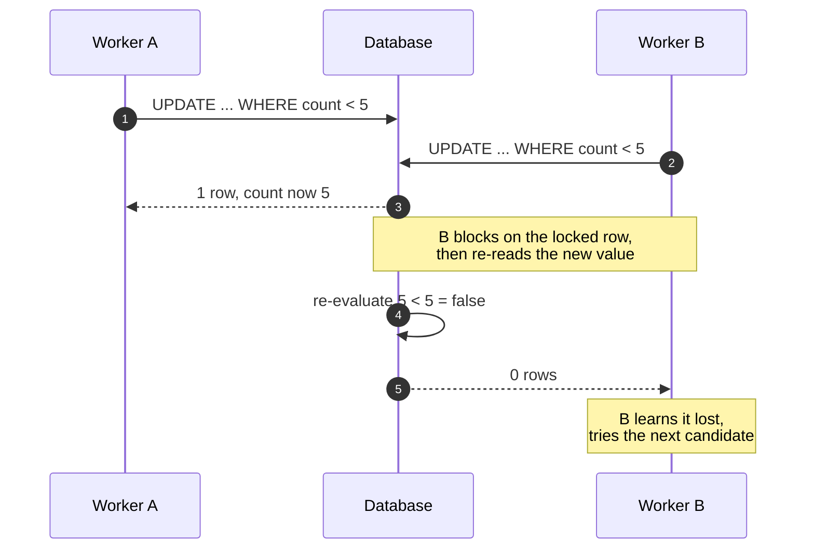

PostgreSQL locks a row while updating it. The second worker blocks, then re-reads the updated
value and re-evaluates its own `WHERE` condition against it. `5 < 5` is false, so it matches
zero rows.

**Verified.** 16 threads released simultaneously against one slot: 1 succeeded, 15 failed the
condition, cap held, no errors. The test fails if no thread loses, since that would indicate
the threads never actually contended.

**Alternative considered.** `SELECT ... FOR UPDATE` is also correct but serialises candidate
selection and introduces lock ordering. The compare-and-set requires neither.

---

## 4. Recompute

### 4.1 User attributes change (Story 3)

**Requirement.** If user attributes change, eligibility must be recomputed automatically.

**Solution.** A `post_save` signal fires only when a **stable** field changed. It schedules a
job that tests the user against every cached rule and writes only the difference — rules
gained, rules lost.

**Why needed.**

*Why only stable fields:* the volatile counters change on every assignment. Triggering
recomputation on them would produce continuous, pointless work (§1.3).

*Why the difference, not a rewrite:* deleting and reinserting a user's rows obscures what
changed. Gaining a rule is an actionable event — it is what re-queues pooled tasks that user
can now take.

*Why not an inverted index over predicates:* testing one user against ~1,000 cached rules is a
microsecond-scale in-memory loop. An index would add code, add invalidation surface, and run
slower at this cardinality.

*Why debounced:* a burst of edits to one user would otherwise queue one job per edit. The job
is scheduled a short delay ahead and repeat edits within that window are absorbed, so it reads
settled state.

**Known limitation.** `queryset.update()` and `bulk_create()` do not emit Django signals. Code
paths using them must call the recompute directly.

### 4.2 Rules change (Story 4)

**Requirement.** If task rules change, the system must recompute eligible users efficiently.

**Solution.** See §1.4. The task's rule pointer moves; the rule itself is never edited.

**Cost.**

```
new rule hash already exists  → 0 work
new rule hash is new          → 1 indexed scan of users
```

**Why needed.** The alternative — recomputing eligibility for the edited task — performs the
same work on every edit and scales with the number of tasks. Content addressing makes the
common case free, because rule reuse is common.

### 4.3 Task completion

**Requirement.** Status Todo → In Progress → Done.

**Solution.** Completion runs in one transaction:

```
status                 → done
active_task_count      -= 1              slot freed
committed_effort_hours -= effort         }  effort moves from current load
lifetime_hours         += effort         }  to historical record
then: fill_capacity(assignee)
```

**Why needed.** These four values must agree. If the status changed but a counter did not, the
user appears permanently busier than they are, and every later selection is skewed with nothing
to indicate why. A transaction makes them all succeed or all fail.

**Cancellation is separate.** It frees the slot and decrements committed hours but does **not**
credit lifetime hours — no work was delivered, and crediting it would corrupt selection key 2
(§2.1).

**Terminal states are not reachable through a field edit.** `PATCH` allows only
`todo ↔ in_progress`. Reaching `done` or `cancelled` goes through the completion endpoint, so
the counter updates cannot be bypassed.

**Deleting a task releases its capacity first**, for the same reason.

---

## 5. Required APIs

| Endpoint | Solution | Why |
|---|---|---|
| `POST /tasks/` | Creates the task, deduplicates the rule, queues placement | Returns immediately; placement runs in a worker (§6) |
| `GET /tasks/{id}/eligible-users` | Stored eligible set ∩ live capacity filter, in ladder order | The stored half is stable; the capacity half must be current (§1.3) |
| `GET /my-eligible-tasks` | Tasks assigned to the caller | See below |
| `POST /tasks/recompute-eligibility` | Queues materialisation, returns 202 + job ids | A full recompute is minutes of work; a synchronous response would time out |

Also provided: `GET /tasks/` (filtered, paginated, role-scoped), `GET`/`PATCH`/`DELETE
/tasks/{id}`, `POST /tasks/{id}/complete`, signup/login/refresh, `/schema`, `/docs`.

**`/my-eligible-tasks` interpretation.** "Eligible **and** assigned" is read as the
conjunction: a user sees a task once it is assigned to them. Assignment already implies
eligibility, so the query is an index lookup on the user's own rows, bounded by their task cap.
There is no self-service pool, which is consistent with tasks not being manually assigned.

**Recompute idempotency.** A rule already being materialised is skipped by a single-flight
lock, so submitting the same request twice performs the work once.

---

## 6. Background processing

**Requirement.** The system computes eligible users in the background.

**Solution.** Redis holds a job queue; Celery workers consume it. The web server queues work
and responds immediately.

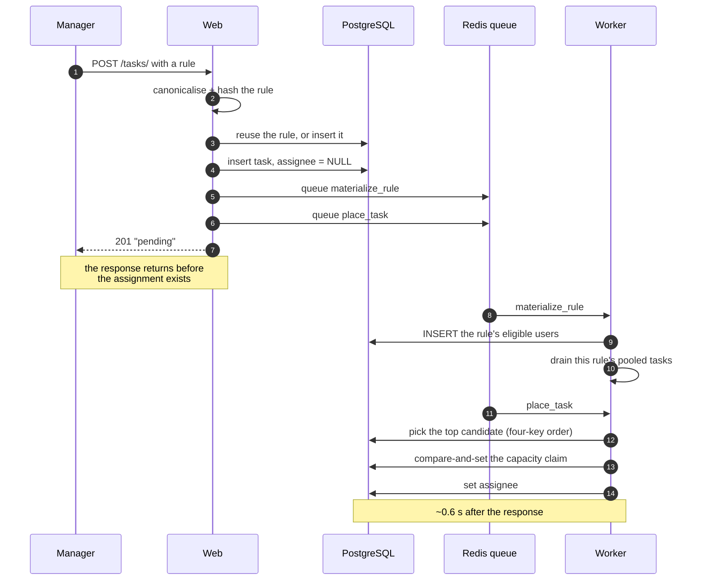

**Why needed.** Assignment scans a rule's eligible users and must survive competing claims.
Performing that inside the HTTP request means the client holds a connection while it runs, and
a broad rule blocks the response. Queueing makes task creation cost the same regardless of how
many users a rule matches.

**Consequence.** The create response cannot report the assignee, because it does not exist yet
(§2.2).

**Periodic jobs** (Celery beat, in the worker process):

| Job | Purpose | Why |
|---|---|---|
| Pool sweep | Re-place pooled tasks | Queue messages can be lost. This recovers them. It logs a warning when it places anything, because regular activity indicates the event path is broken |
| Stuck-task check | Log tasks unassignable beyond a threshold | A task no one can see is indistinguishable from one that was never created |

---

## 7. Performance

**Requirement.** 100k users, 1M tasks, APIs under 200ms using caching, indexing, background
processing.

### 7.1 Indexing

An index is a sorted structure that avoids reading every row.

| Index | Purpose | Why |
|---|---|---|
| `users (department, experience_years)` | Materialising one rule | Turns a full scan into a range read |
| `users_selection_order` (all four ladder keys) | Selecting an assignee | Lets the database walk the ordering and stop at the first match instead of collecting and sorting every eligible user |
| `rule_eligible_user (rule_id, user_id)` | "Who is eligible for this rule?" | Forward direction |
| `rule_eligible_user (user_id, rule_id)` | "Which rules does this user match?" | Reverse direction, used by recompute |
| `tasks (rule, priority, created_at)` partial | Draining the pool | Partial on open tasks only |
| `tasks (assignee, priority, due_date)` partial | `/my-eligible-tasks` | Partial on open tasks only |

**Why partial indexes.** `WHERE status <> 'done'` keeps index size proportional to open work
rather than lifetime task volume. Over a million tasks with most completed, this determines
whether the index stays in memory.

**Index direction matters.** `priority` is indexed ASC because 0 is the highest priority. A DESC
index would serve the drain backwards — producing a working system that assigns in exactly the
wrong order.

### 7.2 Caching

| Cached | Invalidation | Why |
|---|---|---|
| Rule predicates and cap | None — immutable | Read on every assignment; rule rows never change (§1.4) |
| Single-flight lock on materialisation | On completion, plus TTL | Prevents N workers performing the same scan after one invalidation |
| Recompute debounce key | Window expiry | Collapses a burst of edits into one job |
| **Volatile counters** | **Not cached** | A stale capacity value produces assignments that exceed the cap |

The per-rule eligible-set cache was measured and removed: the query it would replace runs at
1.65 ms, and the capacity filter must reach the database regardless, so the cache adds
invalidation surface without reducing work.

### 7.3 Measured

100,000 users, 1,000,000 tasks, 15,384,332 eligibility rows (2,380 MB). 8 concurrent workers,
400 iterations after warmup. SQL layer — excludes HTTP, serialisation, and network.

| Query | p50 | p95 | Rate |
|---|---|---|---|
| `/my-eligible-tasks` | 0.38 ms | 1.46 ms | 8,778/s |
| `/tasks/{id}/eligible-users` | 0.89 ms | 1.65 ms | 4,991/s |
| Select assignee | 0.26 ms | 0.68 ms | 14,423/s |
| Select next pooled task | 0.39 ms | 0.81 ms | 9,943/s |

No sequential scans on any request-path query; the benchmark asserts this rather than reporting
it, because a plan regression is not visible until the table grows.

**Row count model.** Predicted `rules × selectivity × users = 1000 × 0.1538 × 100,000 =
15,380,000`. Actual: 15,384,332.

### 7.4 Operational requirement

`users_selection_order` has a volatile leading column, so every assignment relocates an index
entry. A B-tree does not reuse that space the way a table does.

| After | Index size |
|---|---|
| Baseline (2,000 users) | 216 kB |
| 200,000 updates | 12 MB |
| 400,000 updates | 23 MB |
| `VACUUM` | unchanged |
| `REINDEX` | 112 kB |

`REINDEX INDEX CONCURRENTLY users_selection_order` must be scheduled. Without it, query
performance degrades gradually with no error to observe.

---

## 8. Authentication and authorization

**Requirement.** Signup, login, roles Admin/Manager/User.

**Solution.** JWT access tokens with refresh. Three roles:

| Role | Permissions |
|---|---|
| Admin | System administration, recompute endpoint |
| Manager | Authors tasks and rules; edits task fields |
| User | Receives tasks; moves own tasks between todo and in_progress |

**Why needed.** Authoring a rule determines who receives work, so it is restricted. A user
sees only their own tasks, consistent with visibility following assignment (§5).

Creating a user triggers eligibility evaluation, so a new account can immediately receive
pooled work — this is the "user created" event from §2.4, not signup-specific logic.

**Known limitation.** Tokens are stored in `localStorage`, which is exposed to XSS. httpOnly
cookies with CSRF protection would be used in production.

---

## 9. Data model

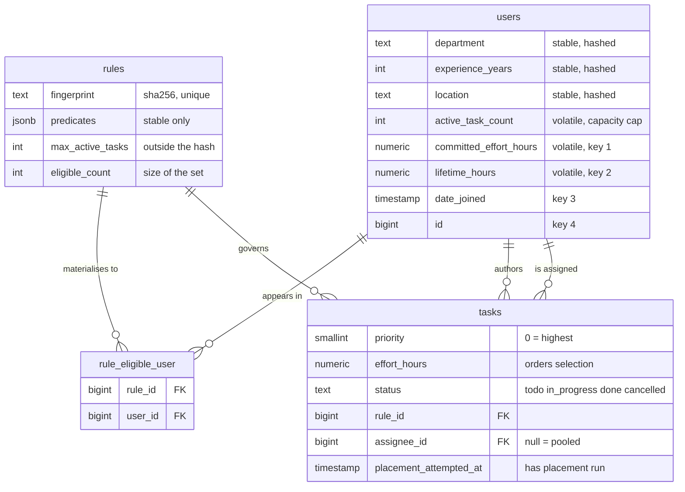

```
users
  department, experience_years, location      stable: hashed, materialised
  active_task_count                           volatile: capacity cap
  committed_effort_hours                      volatile: selection key 1
  lifetime_hours                              volatile: selection key 2
  date_joined                                 selection key 3
  id                                          selection key 4

rules                                         immutable, content-addressed
  fingerprint (sha256, unique)
  predicates (JSON, stable only)
  max_active_tasks                            held outside the hash
  eligible_count, materialized_at

rule_eligible_user                            the materialised eligibility
  (rule_id, user_id)

tasks
  title, description, due_date, effort_hours
  priority (smallint, 0 = highest)
  status (todo | in_progress | done | cancelled)
  rule_id, created_by, assignee (null = pooled)
  placement_attempted_at
```

**Why `max_active_tasks` sits outside the hash.** Two rules differing only in their cap must
share one materialised eligible set. Including the cap in the hash would compute the same user
list twice.

**Why counters are denormalised.** `active_task_count` and `committed_effort_hours` are read on
every selection query. Deriving them with `COUNT(*)` and `SUM()` puts aggregates on the hot
path, and makes the compare-and-set in §3 impossible — the check must reference a column.

The cost is that they can drift, so they are written only inside the assignment and completion
transactions, and can be rebuilt from the tasks table.

---

## 10. Deliberate exclusions

| Not built | Reason | Ceiling |
|---|---|---|
| Rule expression language | Closed attribute set; would break deduplication | If nesting is required, migrate to a rule tree keeping the stable/volatile split |
| Preemption | Priority orders the queue, not access to capacity | Would require unassignment semantics and discarding work in progress |
| Composite primary key on `rule_eligible_user` | Django 4.2 cannot express one | Costs 330 MB at 15.4M rows; Django 5.2 supports it |
| Eligible-set cache | Measured slower than the query | — |
| Notification delivery | Removed from scope | Stuck-task alerts log a warning instead |

---

## 11. Verification

56 tests. They cover the paths where an error is not visible at runtime:

| Test area | What it prevents |
|---|---|
| `to_sql` ≡ `matches`, exhaustive | The two evaluators diverging |
| Priority overtake | A newly created task taking a slot a waiting P0 should have |
| 16-thread capacity race | Two workers passing the same capacity check |
| Drain ordering | Priority and age keys being applied in the wrong order |
| Recompute deltas | Eligibility not following an attribute change |
| Counter release on delete | Capacity leaking when a task is removed |
| Cache and lock failure modes | A lock wedging a rule permanently |

`docker compose up --build` runs all five services: PostgreSQL, Redis, web, worker, frontend.

README §12 lists which claims are measured and which are reasoned.

---

## 12. Consistency model

Stated with windows, because "eventually consistent" without one is not a specification.

| Property | Guarantee | Why this level |
|---|---|---|
| Capacity cap | **Strong.** Enforced transactionally by the compare-and-set (§3) | An exceeded cap is a broken promise to an overloaded person, and nothing corrects it |
| Assignment counters | **Strong.** Written only inside the assignment or completion transaction | If status and counters disagree, selection is skewed permanently with nothing to indicate why |
| Stable eligibility | **Eventual**, bounded by queue latency — roughly one worker hop | A stale eligible set costs a delayed assignment, and the next event corrects it |
| Pool drain | **Eventual**, same bound, with the sweep as the outer limit | Same reasoning; a dropped queue message is recoverable |
| `/my-eligible-tasks` | **Strong.** Reads committed rows, no cache | It is a bounded index lookup; a cache would add staleness for no measurable gain |

The asymmetry is deliberate: consistency is bought where a failure is permanent, and skipped
where the system self-corrects.

---

## 13. Assumptions and open questions

Nothing in this system fills a gap silently. Every quantity is **given** (stated in the brief),
**derived** (follows from a given), **declared** (an assumption, marked), or **resolved** (a
decision taken with the requester).

### Declared assumptions

| Assumption | If it is wrong |
|---|---|
| One assignee per task | The brief says "assigns the task to *the* eligible user". Multiple assignees change the counter semantics in §3 |
| `active_task_count` counts every non-terminal task, `todo` and `in_progress` alike | Shifts when capacity frees |
| `max_active_tasks` is per rule and optional; no global default | The brief's `< 5` is an example inside a rule, not a system setting |
| `effort_hours` is an estimate set at creation and editable | Editing it adjusts committed hours but gates nothing, so it can never invalidate an existing assignment |
| Departments are distributed evenly across users | Only used to bound rule selectivity at ≤ 0.25; skew raises it for large departments |
| Storage is SSD | `random_page_cost = 1.1`. Wrong on spinning or high-latency network storage |
| Single PostgreSQL instance | All sizing assumes one node — no sharding, no read replicas |
| Manual reassignment is not supported | The brief's premise is that assignment is not manual |

### Additions beyond the brief, and why

| Addition | Why it was necessary |
|---|---|
| `id` as the fourth selection key | Account timestamps are not unique, so without it the ordering is not total and tied rows return arbitrarily. Measured: 17 users tied on the first three keys |
| `effort_hours` on tasks | "Least loaded" measured in task count treats one 8-hour task as equal to four 30-minute ones |
| `lifetime_hours` on users | Selection key 2; without it, equally-loaded users are separated only by account age |
| `placement_attempted_at` on tasks | Distinguishes "the worker has not run" from "the worker ran and found nobody" — two states requiring opposite responses (§2.2) |
| `created_by` on tasks | Records who authored a task; audit data |
| `cancelled` status | The brief has only `done`. A cancelled task must free capacity **without** crediting delivered work |

### Resolved with the requester

| Question | Resolution |
|---|---|
| What does a Manager do? | Managers author rules and tasks. Admin is system administration |
| "Eligible **and** assigned" in Story 2 | The conjunction — a user sees a task once assigned. No self-service pool |
| Does priority preempt? | No. It orders the queue; it does not displace work in progress |
| Ordering within a priority band | Oldest first |
| Multi-department or multi-city rules | Not supported. One department, at most one location |

### Unresolved

| Question | Status |
|---|---|
| Actual distinct-rule count in production | Unknowable before the system runs. Measured instead: selection latency is flat across rule counts from 10² to 5×10³, so this quantity constrains storage rather than speed |
| Expected request throughput | The brief gives a latency target with no load figure. Every measurement in §7 therefore publishes the concurrency and rate it was taken at, rather than asserting one |

---

## 14. Requirement traceability

Every line of the brief against its implementation.

### Core features

| Requirement | Where | Section |
|---|---|---|
| User signup and login | `POST /auth/signup`, `/auth/login`, `/auth/refresh` | §8 |
| Roles: Admin, Manager, User | `User.Role`, enforced per endpoint | §8 |
| CRUD on tasks | `GET`/`POST /tasks/`, `GET`/`PATCH`/`DELETE /tasks/{id}` | §5 |
| Status Todo → In Progress → Done | `PATCH` for open states, `/complete` for terminal | §4.3 |
| Due dates and priority | `due_date`, `priority` | §9 |
| Tasks are NOT manually assigned | No endpoint accepts an assignee; one function sets one | §2.4 |
| Each task defines dynamic rules | `rules` on create, repointed on `PATCH` | §1 |

### User profile attributes

| Attribute | Field | Handling |
|---|---|---|
| Department | `department` | Stable — hashed, materialised |
| Experience in years | `experience_years` | Stable |
| Location | `location` | Stable |
| Current number of assigned tasks | `active_task_count` | Volatile — live filter, never materialised |

### User stories

| Story | Where |
|---|---|
| 1 — Admin creates a task with rules; system assigns in background | §1, §2, §6 |
| 1a — What if multiple eligible users? | §2.1 |
| 1b — What if no eligible users? | §2.2 |
| 2 — User views eligible tasks, highly optimised | §5 |
| 3 — User data changes, eligibility recomputes | §4.1 |
| 4 — Admin updates rules, recompute efficiently | §4.2 |

### Required APIs

| Required | Measured p95 |
|---|---|
| `POST /tasks/` | — |
| `GET /tasks/{id}/eligible-users` | 1.65 ms |
| `GET /my-eligible-tasks` | 0.38 ms |
| `POST /tasks/recompute-eligibility` | 202 + job ids |

### Deliverables

| Deliverable | Status |
|---|---|
| Public GitHub repository | Done |
| Docker setup | Done, verified running |
| DB migrations | Done — 5 migrations, apply and reverse cleanly |
| README explaining architecture, indexing, caching, rule engine, recompute | This document, §1–§7 |
| Seed data | `seed` (demo, drives the real code paths) and `seed_scale` (benchmark) |
| API documentation | OpenAPI at `/schema`, Swagger at `/docs`, no generation errors |

---

## 15. Evidence: measured versus reasoned

Claims are separated by how they are supported. Everything measured was taken at
100,000 users / 1,000,000 tasks / 15,384,332 eligibility rows unless noted.

| Claim | Support |
|---|---|
| No sequential scan on any request-path query | **Measured.** The benchmark asserts it |
| p95 ≤ 1.65 ms on both read endpoints, 8 workers | **Measured** |
| p95 ≤ 0.81 ms on both assignment queries | **Measured** |
| Eligibility rows = rules × selectivity × users | **Measured.** Predicted 15,380,000, actual 15,384,332 |
| Eligibility storage is 162 bytes per row | **Measured.** 2,380 MB over 15.4M rows |
| Two per-foreign-key indexes were redundant | **Measured.** Removing them saved 233 MB |
| The fourth selection key is load-bearing | **Measured.** 17 users tied on keys 1–3 |
| Additional selection keys cost nothing meaningful | **Measured.** 31.9 ms vs 24.7 ms, both dominated by the join plan |
| Rule count constrains storage, not latency | **Measured.** p95 flat across rule counts 10² → 5×10³ |
| The planner chooses the ordered-index walk unaided | **Measured.** No application-level plan switch is needed |
| The selection index bloats and `VACUUM` will not reclaim it | **Measured.** 216 kB → 23 MB over 400k updates; `REINDEX` → 112 kB |
| A waiting P0 is never overtaken | **Tested.** The failure is reproduced against the two-path design, then the fix proven |
| The capacity cap holds under concurrency | **Tested.** 16 threads, 1 winner, 15 losers, no errors |
| The two rule evaluators agree | **Tested** exhaustively over a generated rule space |
| Write load is human-paced | **Derived**, not measured — tasks are authored manually, so assignment rate is bounded by human activity |
| End-to-end HTTP latency | **Not measured.** All figures are SQL-layer and exclude HTTP, serialisation and network |

### Measurement caveats

The benchmark seed correlates rule membership with load in a way real data would not, which
distorts how far the index walk travels. Direction and order of magnitude hold; exact
latencies would need a realistic distribution.

`seed_scale` writes the *outcome* of assignment in bulk SQL rather than driving the assigner,
because placing a million tasks individually would take hours. A successful run of it is not
evidence that assignment is correct — the test suite is.

### Claims withdrawn after measurement

| Claim | Outcome |
|---|---|
| `random_page_cost = 1.1` is worth roughly 2× | **Withdrawn.** True on a synthetic schema; on the real one it moved p95 by 0.02 ms. The setting is retained because 4.0 models the wrong storage, but it is not load-bearing |
| `/my-eligible-tasks` needs a payload cache for its fan-out | **Withdrawn.** Under the conjunction reading (§5) it is a bounded index lookup at 0.38 ms |
| A per-rule eligible-set cache is needed | **Withdrawn.** The query it would replace runs at 1.65 ms and the capacity filter must reach the database regardless |
| An application-level query plan switch is needed | **Withdrawn.** The planner selects the intended plan without help |
