# Dynamic Rule-Based Task Assignment

A task management system where tasks are never assigned by hand. Each task carries a **rule**
describing who may do it; the system computes which users satisfy that rule and assigns the
task in the background, in priority order.

**Django 4.2 + DRF · PostgreSQL 14 · Redis · Celery · React 18 · Docker Compose**

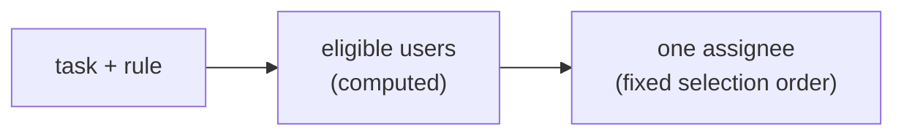

Built and measured at the stated scale: **100,000 users, 1,000,000 tasks.**

---

## Running it

```bash
docker compose up --build
```

| | |
|---|---|
| UI | http://localhost:5173 |
| API documentation (Swagger) | http://localhost:8000/docs |
| OpenAPI schema | http://localhost:8000/schema |

Logins after seeding: `manager` / `manager`, `admin` / `admin`, or any `userNNNN` / `demo`.

Without Docker, against a local PostgreSQL:

```bash
python -m venv .venv && .venv/bin/pip install -r requirements.txt
createdb taskassign
POSTGRES_HOST=/tmp POSTGRES_PORT=5432 .venv/bin/python manage.py migrate
.venv/bin/python manage.py seed --users 200 --rules 8 --tasks 50
.venv/bin/python manage.py test assignment
```

Celery runs jobs inline unless `CELERY_EAGER=0`, so the test suite and a bare `runserver`
exercise the whole assignment path without a broker.

---

## Deliverables

| # | Deliverable | Status | Where |
|---|---|---|---|
| 1 | Public GitHub repository | Done | This repository |
| 2 | Docker setup | Done, verified running | [Docker setup](#docker-setup) |
| 3 | DB migrations | Done — 5, apply and reverse cleanly | [Part 4.4](#44-migrations) |
| 4a | README: **architecture decisions** | Done | [Part 1](#part-1--architecture-decisions) |
| 4b | README: **indexing strategy** | Done | [Part 4.2](#42-indexing-strategy) |
| 4c | README: **caching strategy** | Done | [Part 5](#part-5--caching-strategy) |
| 4d | README: **rule engine design** | Done | [Part 2](#part-2--rule-engine-design) |
| 4e | README: **recompute strategy** | Done | [Part 3](#part-3--recompute-strategy) |
| 5 | Seed data | Done — demo and benchmark seeds | [Seed data](#seed-data) |
| 6 | API documentation | Done — OpenAPI + Swagger, no generation errors | [API documentation](#api-documentation) |

## Evaluation criteria

| Criterion | Where it is addressed |
|---|---|
| Architecture quality | [Part 1 — Architecture decisions](#part-1--architecture-decisions) |
| Database design & indexing | [Part 4 — Database design and indexing](#part-4--database-design-and-indexing) |
| Performance optimisation | [Part 6 — Performance optimisation](#part-6--performance-optimisation) |
| Clean code and structure | [Part 8 — Code structure](#part-8--code-structure) |
| Rule engine implementation | [Part 2 — Rule engine design](#part-2--rule-engine-design) |
| Background processing design | [Part 7 — Background processing design](#part-7--background-processing-design) |

Supporting material: [Appendix A — assumptions](#appendix-a--assumptions-and-open-questions) ·
[Appendix B — traceability](#appendix-b--requirement-traceability) ·
[Appendix C — measured vs reasoned](#appendix-c--evidence-measured-versus-reasoned) ·
[Appendix D — verification](#appendix-d--verification)

Each section states the **requirement**, the **solution**, and **why that solution is
necessary** — expressed as what breaks without it. Backend concepts are explained where they
first appear.

---

# Part 1 — Architecture decisions

## 1.1 The problem

A task carries a rule describing who may do it. No one selects an assignee; the system computes
who qualifies and assigns automatically.

The difficulty is not the volume on either side. A 100,000-row user table is unremarkable and a
million task rows is ordinary. The cost is the **relationship** between them, which must stay
correct while both sides change.

## 1.2 Components

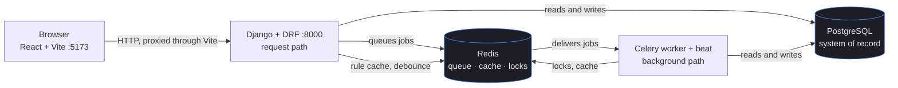

The split between the two paths is load-bearing: **no assignment decision is ever made on the
request path.** The web process saves a task and queues work; the worker decides who receives it.

## 1.3 Decision: eligibility is stored per rule, not per task

**Requirement.** Each task defines rules; the system computes eligible users.

**Solution.** Rules are normalised to a canonical form, hashed with SHA-256, and the hash is the
rule's identity. Two tasks whose rules hash identically share one stored eligible set.

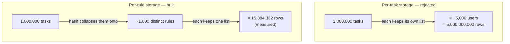

**Why needed.** Storing eligibility per task gives:

```
rows = tasks × eligible users per task
     = 1,000,000 × ~5,000
     = 5,000,000,000
```

Hundreds of gigabytes, and it must be updated whenever any user changes. Storing per rule gives
`rules × eligible users per rule`. The ratio between the two is `tasks / rules` — measured on
seeded data at **1000:1**.

The saving does not depend on how selective rules are: selectivity and user count appear in both
expressions and cancel. That is why this decision carries no estimate.

## 1.4 Decision: predicates are split by volatility

**Requirement.** Rules combine department, experience, location, and active task count.

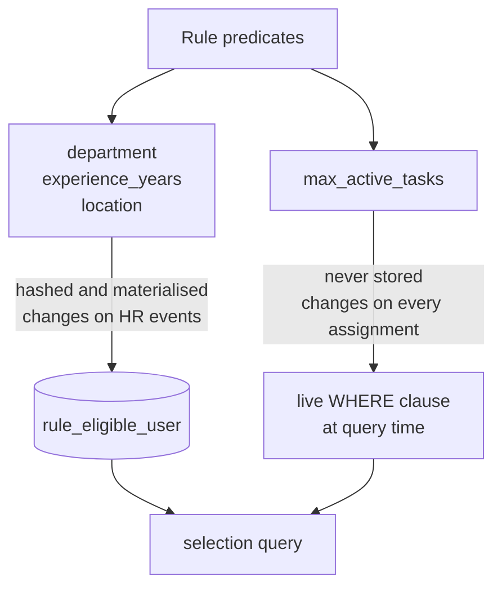

| Predicate | Changes when | Handling |
|---|---|---|
| Department | HR event | Stored (materialised) |
| Experience | HR event | Stored |
| Location | HR event | Stored |
| Active task count | Every assignment and completion | **Not stored.** Live filter at query time |

**Why needed.** `active_tasks < 5` changes on every assignment. If it were part of stored
eligibility, one assignment would invalidate every stored set containing that user. At the stated
scale the system would spend all its time recomputing itself.

Splitting means the fastest-changing field produces no background work at all.

**Evidence the boundary is correctly placed:** two selection dimensions were added late in the
build and required no change to the eligibility table, because they are volatile and never
entered the hash.

## 1.5 Decision: rules are immutable

**Requirement.** Admin updates a task's rules (Story 4).

**Solution.** Rule rows are never modified. Changing a task's rule points it at a different rule
row, created only if its hash is new.

**Why needed.** If rules were mutable, editing one would invalidate the stored eligibility of
every task referencing it — cost proportional to task count. As a pointer swap:

```
hash already exists  → no recomputation at all
hash is new          → one indexed scan of the users table
```

Neither cost depends on how many tasks use the rule.

## 1.6 Decision: one assignment path

**Requirement.** Higher-priority tasks are assigned first.

**Solution.** Exactly one function assigns tasks. Five events call it.

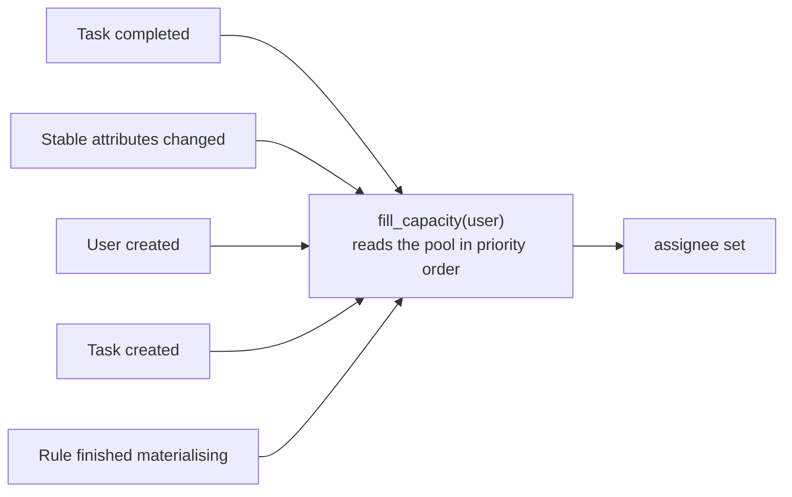

**Why needed.** With two assignment paths — a direct assign on creation plus a pool drain on
completion — the priority guarantee fails:

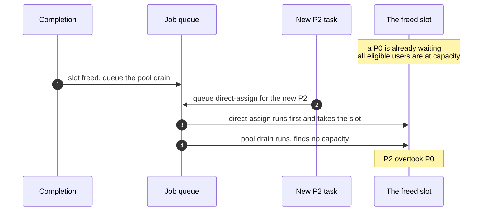

The direct path does not consult the pool, so it cannot know a higher-priority task is already
waiting. Routing every event through one function that always reads the pool in priority order
makes the guarantee structural rather than dependent on job execution order.

## 1.7 Decision: capacity is claimed with a compare-and-set

**Requirement.** Assignment must respect `active_tasks < N`.

**Why needed.** Reading a value, deciding, then writing is three separate operations. Another
process can act between them:

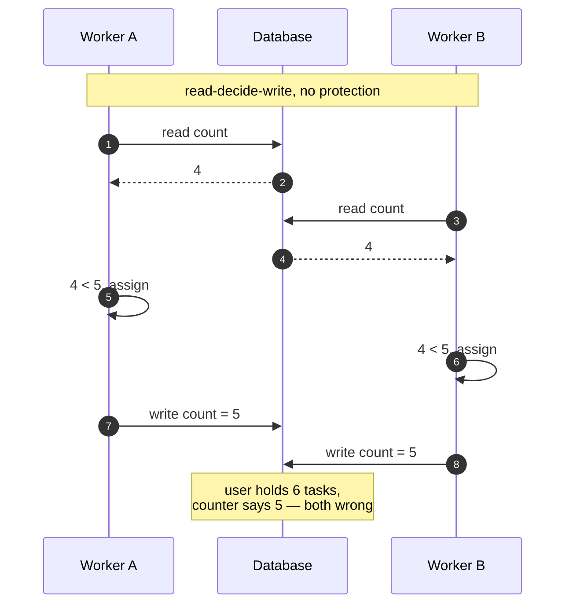

**Solution.** The capacity check goes inside the write:

```sql
UPDATE users
   SET active_task_count      = active_task_count + 1,
       committed_effort_hours = committed_effort_hours + %(effort)s
 WHERE id = %(user_id)s
   AND active_task_count < %(cap)s
RETURNING id;
```

Zero rows returned means another worker took the slot; the caller tries the next candidate.

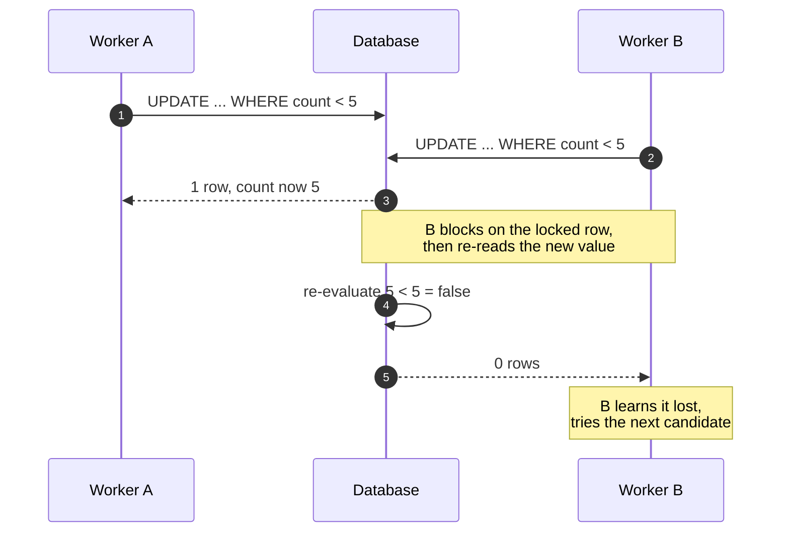

PostgreSQL locks a row while updating it. The second worker blocks, re-reads the updated value,
and re-evaluates its own `WHERE` condition against it.

**Verified.** 16 threads released simultaneously against one slot: 1 succeeded, 15 failed the
condition, cap held, no errors. The test fails if no thread loses, since that would indicate the
threads never contended.

**Alternative considered.** `SELECT ... FOR UPDATE` is also correct but serialises candidate
selection and introduces lock ordering. The compare-and-set needs neither.

## 1.8 Decision: selection is a four-key deterministic order

**Requirement.** "What will happen if there are multiple eligible users?"

**Solution.** A four-key ordering. The first row is the assignee.

```sql
ORDER BY committed_effort_hours ASC,   -- 1. least current load, in hours
         lifetime_hours         DESC,  -- 2. most work delivered historically
         date_joined            ASC,   -- 3. older account
         id                     ASC    -- 4. unique tiebreaker
```

| Key | What it expresses | Why it is needed |
|---|---|---|
| 1 | Fairness of current burden | The rules themselves constrain load, so optimising the same quantity keeps users away from their cap and reduces how often tasks become unassignable. Measured in **hours**, because task count treats one 8-hour task as equal to four 30-minute ones |
| 2 | Track record | Separates equally-loaded users. Keys 1 and 2 point in opposite directions by design: least current burden, most historical delivery |
| 3 | Seniority | Separates users equal on both load and history |
| 4 | Total order | Account timestamps are not unique — a bulk import writes many identical values. Without a unique final key the ordering is not total, so tied rows return in database-chosen order: results are irreproducible, and in practice the same user is returned repeatedly. **Measured: 17 users tied on keys 1–3** |

**Alternative considered.** A single-key ordering measured 24.7 ms against 31.8 ms for the
four-key ladder — a 7 ms difference on a query whose cost lay in the join plan, not the ordering.
The additional keys cost nothing measurable, so all four are retained.

## 1.9 Decision: unassignable tasks are pooled, not rejected

**Requirement.** "What will happen if there are no eligible users?"

**Solution.** The task is created and left unassigned in a pool. Three states are reported
distinctly:

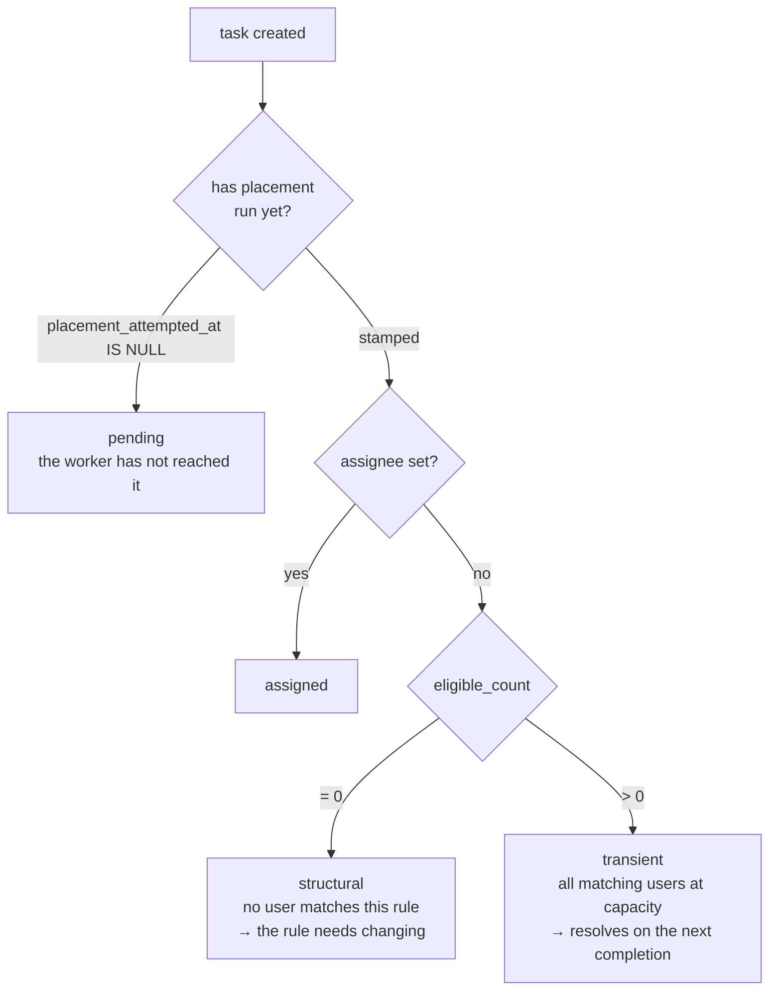

**Why needed.**

*Why not reject:* a rule matching nobody today may match tomorrow — a new hire joins, an assignee
finishes work. Rejecting at creation forces the creator to poll and retry by hand.

*Why three states rather than two:* structural and transient failures require opposite responses
— fix the rule, versus wait. One message for both leaves the creator unable to tell a mistake
from normal contention.

*Why "pending" exists:* assignment runs in a worker, so when the API responds the outcome does
not yet exist. `placement_attempted_at` on the task records whether placement has run, making the
distinction a stored fact rather than a guess.

## 1.10 Decision: task selection order

**Requirement.** Tasks have priority.

**Solution.** When capacity frees, pooled tasks are taken in this order:

```sql
ORDER BY priority ASC,      -- 0 = P0, highest
         created_at ASC     -- oldest first within a priority band
```

**Why needed.** Priority alone is not a total order. Without a second key a task can be passed
over indefinitely while newer tasks of equal priority are chosen ahead of it. `created_at` makes
each band a queue with bounded waiting time.

`priority` is stored as an integer, not text: text sorts alphabetically, so `'P10'` sorts before
`'P2'` — incorrect as soon as priorities exceed single digits.

**Priority does not preempt.** A P0 arriving when all users are at capacity waits like any other
task and takes the next freed slot. It does not displace work in progress.

---

# Part 2 — Rule engine design

## 2.1 Rule shape

A rule is a flat AND of at most four optional predicates, each single-valued:

```json
{
  "department":       "Finance",
  "experience_years": { "gte": 4 },
  "location":         "Bangalore",
  "max_active_tasks": 5
}
```

The first three are **stable** and enter the hash. `max_active_tasks` is **volatile** and is
stored beside the rule, not inside it.

**Why no rule language.** Two reasons:

1. The attribute set is closed — four fields. A general expression language requires a grammar,
   parser, syntax tree, evaluator, and a safety story, to express what fits in a struct.
2. Arbitrary expressions have unbounded variety. Rules would stop repeating, the deduplication in
   §1.3 would stop working, and the design's entire leverage would disappear.

**Why single-valued.** One department, at most one location, no OR anywhere. More than one value
is **rejected, not truncated** — a rule that silently dropped a department would route work to the
wrong team with no error to observe. A one-element list is accepted and flattened for older
clients; a repeated value dedupes rather than erroring.

Single-valued predicates also shrink the reachable rule space from a powerset to a product, which
makes rules repeat more often and deduplication work harder.

## 2.2 Canonicalisation and hashing

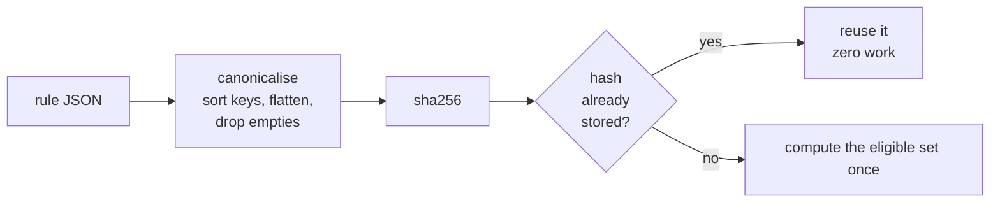

**Requirement.** Identical rules must be recognised as identical.

**Solution.** Before hashing: sort keys, flatten single-element lists, drop empty and null
predicates, coerce numeric types.

**Why needed.** A rule naming only a department, and the same rule with an empty location, express
the same thing. Without normalisation they hash differently and are stored twice. Nothing fails
visibly — the system drifts back toward per-task storage and gets slower. Canonicalisation is what
makes deduplication reliable rather than accidental.

**Why the capacity cap sits outside the hash.** Two rules differing only in their cap must share
one materialised eligible set. Including the cap would compute the same user list twice.

## 2.3 Two evaluators

**Solution.** Two functions over the same canonical JSON:

```python
to_sql(predicates)        -> (where_clause, params)   # one rule → all users
matches(predicates, user) -> bool                     # one user → all rules
```

**Why needed.** The problem runs in two directions with opposite shapes:

```
materialising a rule:        1 rule vs 100,000 users  → belongs in the database
a user's attributes change:  1 user vs   1,000 rules  → belongs in memory
```

A single shared implementation would either load 100,000 users into Python, or issue 1,000
database queries per profile edit.

**The risk this creates, and the answer.** Two implementations can diverge. A property test
asserts they select identical user sets across a generated space of rules — that test is what
makes the duplication safe.

## 2.4 Implementation

`assignment/rules.py`, ~160 lines. Rules arrive from an API, so it is a trust boundary: malformed
input raises an explicit error rather than a `KeyError`, and generated SQL is always
parameterised.

---

# Part 3 — Recompute strategy

Three events change eligibility. Each has a bounded cost.

## 3.1 A user's stable attributes change (Story 3)

**Requirement.** If user attributes change, eligibility must be recomputed automatically.

**Solution.** A `post_save` signal fires only when a **stable** field changed. It schedules a job
that tests the user against every cached rule and writes only the **difference** — rules gained,
rules lost.

**Why only stable fields.** The volatile counters change on every assignment. Triggering
recomputation on them would produce continuous, pointless work (§1.4). Change detection snapshots
the stable fields at load time, so no second query is needed, and a save naming only volatile
fields exits immediately — the common path by a wide margin.

**Why the difference rather than a rewrite.** Deleting and reinserting a user's rows obscures what
changed. Gaining a rule is an actionable event: it is what re-queues pooled tasks that user can
now take.

**Why not an inverted index over predicates.** Testing one user against ~1,000 cached rules is a
microsecond-scale in-memory loop. An index would add code, add invalidation surface, and run
slower at this cardinality.

**Why debounced.** A burst of edits to one user would otherwise queue one job per edit. The job is
scheduled a short delay ahead and repeat edits inside that window are absorbed, so it reads
settled state.

**Known limitation.** `queryset.update()` and `bulk_create()` do not emit Django signals — that is
Django's contract. Code paths using them call the recompute directly.

## 3.2 A task's rules change (Story 4)

**Requirement.** If task rules change, recompute eligible users efficiently.

**Solution.** See §1.5 — the task's rule pointer moves; the rule itself is never edited.

```
hash already exists  → 0 work
hash is new          → 1 indexed scan of users
```

**Why needed.** The alternative — recomputing eligibility for the edited task — performs the same
work on every edit and scales with task count. Content addressing makes the common case free,
because rule reuse is common.

**Declared policy on an assignee who no longer qualifies.** A task still `todo` is released and
re-placed: the author has just redefined who may do it and nothing has started. A task already
`in_progress` keeps its assignee and the mismatch is reported — discarding work in flight is worse
than a temporary mismatch.

## 3.3 A task completes

**Requirement.** Status Todo → In Progress → Done.

**Solution.** One transaction:

```
status                 → done
active_task_count      -= 1              slot freed
committed_effort_hours -= effort         }  effort moves from current load
lifetime_hours         += effort         }  to historical record
then: fill_capacity(assignee)
```

**Why one transaction.** These values must agree. If the status changed but a counter did not, the
user appears permanently busier than they are and every later selection is skewed, with nothing to
indicate why.

**Cancellation is not completion.** It frees the slot and decrements committed hours but does
**not** credit lifetime hours — no work was delivered, and crediting it would corrupt selection
key 2 silently and permanently.

**Terminal states are unreachable through a field edit.** `PATCH` allows only
`todo ↔ in_progress`. Reaching `done` or `cancelled` goes through the completion endpoint, so the
counter updates cannot be bypassed. Deleting a task releases its capacity first, for the same
reason.

---

# Part 4 — Database design and indexing

## 4.1 Data model

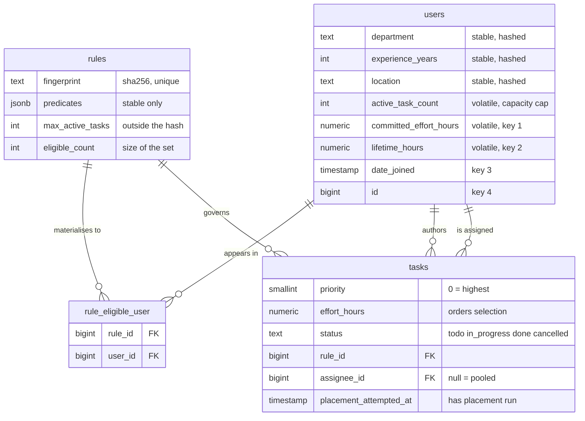

```
users
  department, experience_years, location      stable: hashed, materialised
  active_task_count                           volatile: capacity cap
  committed_effort_hours                      volatile: selection key 1
  lifetime_hours                              volatile: selection key 2
  date_joined                                 selection key 3
  id                                          selection key 4

rules                                         immutable, content-addressed
  fingerprint (sha256, unique)
  predicates (JSON, stable only)
  max_active_tasks                            held outside the hash
  eligible_count, materialized_at

rule_eligible_user                            the materialised eligibility
  (rule_id, user_id)

tasks
  title, description, due_date, effort_hours
  priority (smallint, 0 = highest)
  status (todo | in_progress | done | cancelled)
  rule_id, created_by, assignee (null = pooled)
  placement_attempted_at
```

**Why the counters are denormalised.** `active_task_count` and `committed_effort_hours` are read
on every selection query. Deriving them with `COUNT(*)` and `SUM()` puts aggregates on the hot
path, and makes the compare-and-set in §1.7 impossible — the check must reference a column.

The cost is that they can drift, so they are written only inside the assignment and completion
transactions, and can be rebuilt from the tasks table.

## 4.2 Indexing strategy

An index is a sorted structure that avoids reading every row.

| Index | Purpose | Why |
|---|---|---|
| `users (department, experience_years)` | Materialising one rule | Turns a full scan into a range read |
| `users_selection_order` (all four selection keys) | Choosing an assignee | Lets the database **walk** the ordering and stop at the first match, instead of collecting every eligible user and sorting them |
| `rule_eligible_user (rule_id, user_id)` | "Who is eligible for this rule?" | Forward direction |
| `rule_eligible_user (user_id, rule_id)` | "Which rules does this user match?" | Reverse direction, used by recompute |
| `tasks (rule, priority, created_at)` partial | Draining the pool | Partial on open tasks only |
| `tasks (assignee, priority, due_date)` partial | A user's own work | Partial on open tasks only |

The selection index produces this plan — the order is walked, not sorted:

```
Limit
  -> Nested Loop
       -> Index Scan using users_selection_order on assignment_user
            Filter: (active_task_count < 5)
       -> Index Only Scan using uniq_rule_user on assignment_ruleeligibleuser
            Heap Fetches: 0
```

**Why partial indexes.** `WHERE status <> 'done'` keeps index size proportional to *open* work
rather than lifetime task volume. Over a million tasks with most completed, this determines
whether the index stays resident in memory.

**Index direction matters.** `priority` is indexed ASC because 0 is the highest priority. A DESC
index would serve the drain backwards — producing a working system that assigns in exactly the
wrong order.

**Two indexes were removed after measurement.** Django creates a single-column index per foreign
key by default. On `rule_eligible_user` both were fully covered by the composite indexes already
present, and cost **233 MB** at 15.4M rows. Disabled.

## 4.3 Operational requirement

`users_selection_order` has a volatile leading column, so every assignment relocates an index
entry. A B-tree does not reuse that space the way a table does.

| After | Index size |
|---|---|
| Baseline (2,000 users) | 216 kB |
| 200,000 updates | 12 MB |
| 400,000 updates | 23 MB |
| `VACUUM` | unchanged |
| `REINDEX` | 112 kB |

`REINDEX INDEX CONCURRENTLY users_selection_order` must be scheduled. Without it, query
performance degrades gradually with no error to observe.

## 4.4 Migrations

Five migrations, applying and reversing cleanly:

```bash
python manage.py migrate
```

**Known deviation.** The design specifies a composite primary key `(rule_id, user_id)` on
`rule_eligible_user`. Django 4.2 cannot express one, so the table carries an implicit
`BigAutoField` plus a unique constraint — 330 MB of the measured 2,380 MB at 15.4M rows.
Django 5.2's `CompositePrimaryKey` removes it.

---

# Part 5 — Caching strategy

| Cached | Invalidation | Why |
|---|---|---|
| Rule predicates and cap | None — immutable | Read on every assignment; rule rows never change (§1.5) |
| Single-flight lock on materialisation | On completion, plus TTL | Prevents N workers performing the same scan after one invalidation |
| Recompute debounce key | Window expiry | Collapses a burst of edits into one job |
| **Volatile counters** | **Never cached** | A stale capacity value produces assignments that exceed the cap — the one invariant everything else protects |

**Only the immutable half of a rule row is cached.** `eligible_count` and `materialized_at` sit on
the same row and change on every materialisation. Caching the whole row would serve a stale count
to the "no eligible users" branch and misreport *why* a task is unassigned — the one thing that
branch exists to get right.

**Single-flight is not a latency optimisation.** Rematerialising a rule is the same work whoever
does it, so N workers reacting to one invalidation would perform the scan N times. The loser skips
rather than queues. The lock carries a TTL so a worker dying mid-scan cannot wedge a rule
permanently.

**The per-rule eligible-set cache was designed and then removed.** The query it would replace runs
at p95 1.65 ms, and the capacity filter must reach the database regardless — so the cache would
add invalidation surface without reducing work.

---

# Part 6 — Performance optimisation

**Requirement.** 100k users, 1M tasks, APIs under 200 ms using caching, indexing, background
processing.

## 6.1 Measured

PostgreSQL 14 at exactly that scale — 100,000 users, 1,000,000 tasks, **15,384,332 eligibility
rows (2,380 MB)**. 8 concurrent workers, 400 iterations after warmup.

| Query | p50 | p95 | Achieved rate |
|---|---|---|---|
| `/my-eligible-tasks` | 0.38 ms | 1.46 ms | 8,778/s |
| `/tasks/{id}/eligible-users` | 0.89 ms | 1.65 ms | 4,991/s |
| Select assignee | 0.26 ms | 0.68 ms | 14,423/s |
| Select next pooled task | 0.39 ms | 0.81 ms | 9,943/s |

**Approximately 120× margin** on the 200 ms target.

`manage.py benchmark` **asserts** there is no sequential scan on any request-path query rather
than reporting it, because a plan regression is invisible until the table grows.

The achieved rate is printed beside every latency, because "under 200 ms" means nothing without a
load figure.

**These are SQL-layer measurements.** They exclude HTTP, serialisation and network, so end-to-end
latency is higher. Stated in the benchmark's own docstring.

## 6.2 The row-count model was checked, not trusted

```
predicted:  rules × selectivity × users
            1,000 × 0.1538 × 100,000  =  15,380,000
actual:                                  15,384,332
```

## 6.3 Rule count constrains storage, not latency

Selection latency was measured across rule counts from 10² to 5×10³ at fixed user count. p95
stayed flat on every request-path query. The binding constraint on rule cardinality is disk and
vacuum, not query time.

## 6.4 The three mechanisms the brief names

| Mechanism | Where |
|---|---|
| Indexing | [Part 4.2](#42-indexing-strategy) |
| Caching | [Part 5](#part-5--caching-strategy) |
| Background processing | [Part 7](#part-7--background-processing-design) |

---

# Part 7 — Background processing design

**Requirement.** The system computes eligible users in the background.

## 7.1 Why it is background work

A **queue** (Redis) is a list of jobs. A **worker** (Celery) is a separate process that pulls jobs
and runs them. The web server queues work and responds immediately.

Assignment scans a rule's eligible users and must survive competing claims. Performing that inside
the HTTP request means the client holds a connection while it runs, and a broad rule blocks the
response. Queueing makes task creation cost the same regardless of how many users a rule matches.

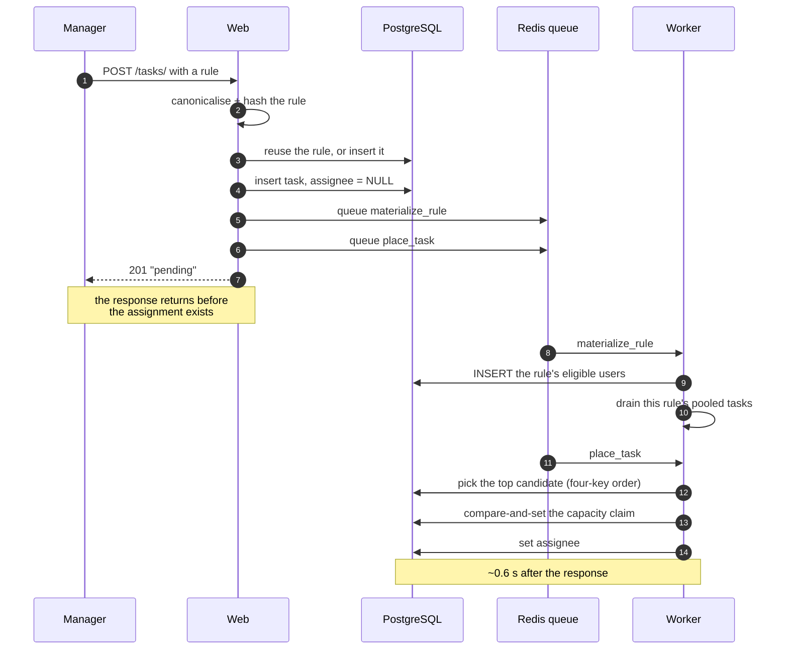

**Consequence.** The create response cannot report the assignee, because it does not exist yet —
which is why `pending` is a reported state (§1.9).

## 7.2 One primitive, five triggers

```
fill_capacity(user):
    while the user is under their cap:
        take the highest-ranked pooled task they are eligible for
        claim it; stop when nothing fits
```

| Trigger | Why it can change the outcome |
|---|---|
| Task completed | A capacity slot freed |
| User's stable attributes changed | The user may now satisfy more rules |
| User created | A new candidate exists |
| Task created | Its rule's best candidate is asked to fill |
| Rule finished materialising | Its eligible set went from empty to populated |

The last trigger is not optional. Materialisation and placement are independent jobs with no
ordering between them, so for a brand-new rule placement routinely runs against an empty
eligibility table.

## 7.3 Periodic jobs

Celery beat runs in the worker process — these are low-frequency safety nets, not throughput work,
so a separate container would add operational surface for nothing.

| Job | Purpose | Why |
|---|---|---|
| Pool sweep | Re-place pooled tasks | Queue messages can be lost. It **logs a warning when it places anything**, because regular activity means the event path is broken |
| Stuck-task check | Report tasks unassignable beyond a threshold | A task no one can see is indistinguishable from one that was never created |

---

# Part 8 — Code structure

```
assignment/
  models.py      schema; stable and volatile fields marked in the model itself
  rules.py       the rule engine: canonicalise, hash, to_sql, matches
  services.py    all business logic; testable without a broker
  signals.py     stable-attribute change detection and debounce
  tasks.py       Celery entry points - thin wrappers over services
  views.py       validate, delegate, serialise
  tests.py       56 tests
  management/commands/
    seed.py         demo data, drives the real service layer
    seed_scale.py   benchmark data, parameterised on rule count and selectivity
    benchmark.py    query plans and latencies, asserts no sequential scans
config/          settings, Celery app, URLs
frontend/        React 18 + Vite
```

**Principles applied:**

- **Logic lives in `services.py`, not views.** Every service function is callable from a test, a
  management command, or a Celery job without HTTP.
- **Celery tasks are thin.** They wrap service functions so the logic is testable without a
  broker.
- **Raw SQL only where it must be exact** — the selection order and the compare-and-set. The ORM
  cannot express a compare-and-set, and the selection query depends on a specific plan.
- **One source of truth per rule.** Status transitions live in `OPEN_TRANSITIONS` and nowhere
  else; restricting the serializer's choices as well would duplicate the rule and replace an
  explanation with a generic validation error.
- **Errors explain themselves.** Refusing a transition returns *"cannot move todo → done. Use
  /tasks/3/complete for done or cancelled, so the capacity counters are updated in the same
  transaction"* rather than a bare rejection.

---

# Part 9 — APIs and remaining deliverables

## API surface

| Method | Path | Notes |
|---|---|---|
| POST | `/auth/signup`, `/auth/login`, `/auth/refresh` | JWT + refresh |
| GET, POST | `/tasks/` | List (filtered, paginated, role-scoped); create with rules |
| GET, PATCH, DELETE | `/tasks/{id}` | Detail; edit fields, status or rules; delete |
| POST | `/tasks/{id}/complete` | Terminal transition; `?cancelled=1` |
| GET | `/tasks/{id}/eligible-users` | Stored set ∩ live capacity filter, in selection order |
| GET | `/my-eligible-tasks` | Tasks assigned to the caller |
| POST | `/tasks/recompute-eligibility` | Queues materialisation, returns 202 + job ids |

**`/my-eligible-tasks` interpretation.** "Eligible **and** assigned" is read as the conjunction: a
user sees a task once it is assigned to them. Assignment already implies eligibility, so the query
is an index lookup on the user's own rows. There is no self-service pool, which is consistent with
tasks not being manually assigned.

**Why recompute returns 202.** A full recompute at this scale is minutes of worker time; a
synchronous response would time out or misrepresent its cost. It is idempotent per rule — a rule
already materialising is skipped by the single-flight lock, so submitting twice does the work once.

## API documentation

| | |
|---|---|
| Swagger UI | http://localhost:8000/docs |
| OpenAPI schema | http://localhost:8000/schema |

Generated from the code by drf-spectacular with **no generation errors**. Swagger's own assets are
served locally rather than from a CDN, so the page works offline.

## Seed data

| Command | Purpose |
|---|---|
| `manage.py seed --users 200 --rules 8 --tasks 50` | Demo data. Drives the **real service layer**, so a successful run exercises the assignment path |
| `manage.py seed_scale --users 100000 --tasks 1000000 --rules 1000` | Benchmark data, parameterised on rule count and selectivity. Writes assignment *outcomes* in bulk SQL — a successful run is **not** evidence that assignment is correct; the test suite is |
| `manage.py seed_scale --degenerate` | The worst case: one unique rule per task |

## Docker setup

Five services: PostgreSQL, Redis, web, worker (with beat), frontend.

```bash
docker compose up --build
```

Verified running end to end: all services reach healthy, the seed runs in-container, the API,
Swagger and UI all respond, and the worker processes placement through Redis.

## Authentication and authorization

| Role | Permissions |
|---|---|
| Admin | System administration, recompute endpoint |
| Manager | Authors tasks and rules; edits task fields |
| User | Receives tasks; moves own tasks between todo and in_progress |

Creating a user triggers eligibility evaluation, so a new account can immediately receive pooled
work — this is the "user created" event from §7.2, not signup-specific logic.

**Known limitation.** Tokens are stored in `localStorage`, which is exposed to XSS. httpOnly
cookies with CSRF protection would be used in production.

---

# Appendix A — Assumptions and open questions

Every quantity is **given** (stated in the brief), **derived**, **declared** (an assumption,
marked), or **resolved** (decided with the requester).

## Declared assumptions

| Assumption | If it is wrong |
|---|---|
| One assignee per task | The brief says "assigns the task to *the* eligible user". Multiple assignees change the counter semantics in §1.7 |
| `active_task_count` counts every non-terminal task | Shifts when capacity frees |
| `max_active_tasks` is per rule and optional | The brief's `< 5` is an example inside a rule, not a system setting |
| `effort_hours` is an estimate set at creation, editable | It gates nothing, so an edit can never invalidate an existing assignment |
| Departments are distributed evenly | Only used to bound rule selectivity at ≤ 0.25 |
| Storage is SSD | `random_page_cost = 1.1`; wrong on spinning or high-latency storage |
| Single PostgreSQL instance | All sizing assumes one node — no sharding, no read replicas |
| Manual reassignment is not supported | The brief's premise is that assignment is not manual |

## Additions beyond the brief

| Addition | Why it was necessary |
|---|---|
| `id` as the fourth selection key | Account timestamps are not unique; measured 17 users tied on the first three keys |
| `effort_hours` on tasks | "Least loaded" by task count treats one 8-hour task as equal to four 30-minute ones |
| `lifetime_hours` on users | Selection key 2 |
| `placement_attempted_at` | Distinguishes "the worker has not run" from "the worker found nobody" |
| `created_by` on tasks | Audit data |
| `cancelled` status | A cancelled task must free capacity **without** crediting delivered work |

## Resolved with the requester

| Question | Resolution |
|---|---|
| What does a Manager do? | Managers author rules and tasks; Admin is system administration |
| "Eligible **and** assigned" in Story 2 | The conjunction — no self-service pool |
| Does priority preempt? | No. It orders the queue; it does not displace work in progress |
| Ordering within a priority band | Oldest first |
| Multi-department or multi-city rules | Not supported |

## Unresolved

| Question | Status |
|---|---|
| Actual distinct-rule count in production | Unknowable before the system runs. Measured instead: latency is flat across rule counts 10² → 5×10³, so this constrains storage rather than speed |
| Expected request throughput | The brief gives a latency target with no load figure, so every measurement publishes the concurrency it was taken at |

## Deliberate exclusions

| Not built | Reason | Ceiling |
|---|---|---|
| Rule expression language | Closed attribute set; would break deduplication | Migrate to a rule tree keeping the stable/volatile split |
| Preemption | Priority orders the queue, not access to capacity | Would require unassignment semantics |
| Composite primary key | Django 4.2 cannot express one | 330 MB at 15.4M rows; Django 5.2 supports it |
| Eligible-set cache | Measured slower than the query | — |
| Rich React UI | Two screens; absent from the evaluation criteria | — |

---

# Appendix B — Requirement traceability

## Core features

| Requirement | Where |
|---|---|
| User signup and login | [Part 9](#authentication-and-authorization) |
| Roles: Admin, Manager, User | [Part 9](#authentication-and-authorization) |
| CRUD on tasks | [Part 9](#api-surface) |
| Status Todo → In Progress → Done | [Part 3.3](#33-a-task-completes) |
| Due dates and priority | [Part 4.1](#41-data-model) |
| Tasks are NOT manually assigned | [Part 1.6](#16-decision-one-assignment-path) |
| Each task defines dynamic rules | [Part 2](#part-2--rule-engine-design) |

## User profile attributes

| Attribute | Field | Handling |
|---|---|---|
| Department | `department` | Stable — hashed, materialised |
| Experience in years | `experience_years` | Stable |
| Location | `location` | Stable |
| Current number of assigned tasks | `active_task_count` | Volatile — live filter |

## User stories

| Story | Where |
|---|---|
| 1 — Admin creates a task with rules; system assigns in background | [Part 1](#part-1--architecture-decisions), [Part 7](#part-7--background-processing-design) |
| 1a — Multiple eligible users? | [Part 1.8](#18-decision-selection-is-a-four-key-deterministic-order) |
| 1b — No eligible users? | [Part 1.9](#19-decision-unassignable-tasks-are-pooled-not-rejected) |
| 2 — User views eligible tasks, highly optimised | [Part 9](#api-surface), [Part 6](#part-6--performance-optimisation) |
| 3 — User data changes, eligibility recomputes | [Part 3.1](#31-a-users-stable-attributes-change-story-3) |
| 4 — Admin updates rules, recompute efficiently | [Part 3.2](#32-a-tasks-rules-change-story-4) |

## Required APIs

| Required | Measured p95 |
|---|---|
| `POST /tasks/` | — |
| `GET /tasks/{id}/eligible-users` | 1.65 ms |
| `GET /my-eligible-tasks` | 0.38 ms |
| `POST /tasks/recompute-eligibility` | 202 + job ids |

---

# Appendix C — Evidence: measured versus reasoned

Claims separated by how they are supported. Measurements at 100,000 users / 1,000,000 tasks /
15,384,332 eligibility rows unless noted.

| Claim | Support |
|---|---|
| No sequential scan on any request-path query | **Measured.** The benchmark asserts it |
| p95 ≤ 1.65 ms on both read endpoints, 8 workers | **Measured** |
| p95 ≤ 0.81 ms on both assignment queries | **Measured** |
| Eligibility rows = rules × selectivity × users | **Measured.** Predicted 15,380,000, actual 15,384,332 |
| Eligibility storage is 162 bytes per row | **Measured.** 2,380 MB over 15.4M rows |
| Two per-foreign-key indexes were redundant | **Measured.** Removing them saved 233 MB |
| The fourth selection key is load-bearing | **Measured.** 17 users tied on keys 1–3 |
| Additional selection keys cost nothing meaningful | **Measured.** 31.9 ms vs 24.7 ms, both dominated by the join plan |
| Rule count constrains storage, not latency | **Measured.** p95 flat across rule counts 10² → 5×10³ |
| The planner chooses the ordered-index walk unaided | **Measured.** No application-level plan switch needed |
| The selection index bloats and `VACUUM` will not reclaim it | **Measured.** 216 kB → 23 MB over 400k updates; `REINDEX` → 112 kB |
| A waiting P0 is never overtaken | **Tested.** The failure is reproduced against the two-path design, then the fix proven |
| The capacity cap holds under concurrency | **Tested.** 16 threads, 1 winner, 15 losers, no errors |
| The two rule evaluators agree | **Tested** exhaustively over a generated rule space |
| Write load is human-paced | **Derived**, not measured — tasks are authored manually |
| End-to-end HTTP latency | **Not measured.** All figures are SQL-layer |

## Measurement caveats

The benchmark seed correlates rule membership with load in a way real data would not, which
distorts how far the index walk travels. Direction and order of magnitude hold; exact latencies
would need a realistic distribution.

## Claims withdrawn after measurement

| Claim | Outcome |
|---|---|
| `random_page_cost = 1.1` is worth roughly 2× | **Withdrawn.** True on a synthetic schema; on the real one it moved p95 by 0.02 ms. Retained because 4.0 models the wrong storage, but it is not load-bearing |
| `/my-eligible-tasks` needs a payload cache | **Withdrawn.** Under the conjunction reading it is a bounded index lookup at 0.38 ms |
| A per-rule eligible-set cache is needed | **Withdrawn.** The query it would replace runs at 1.65 ms |
| An application-level query plan switch is needed | **Withdrawn.** The planner selects the intended plan without help |

---

# Appendix D — Verification

**56 tests**, PostgreSQL 14. They cover the paths where an error is not visible at runtime:

| Test area | What it prevents |
|---|---|
| `to_sql` ≡ `matches`, exhaustive | The two evaluators diverging |
| Priority overtake | A newly created task taking a slot a waiting P0 should have |
| 16-thread capacity race | Two workers passing the same capacity check |
| Drain ordering | Priority and age keys applied in the wrong order |
| Recompute deltas | Eligibility not following an attribute change |
| Counter release on delete | Capacity leaking when a task is removed |
| Cache and lock failure modes | A lock wedging a rule permanently |
| Status transitions | A field edit bypassing the counter bookkeeping |

```bash
python manage.py test assignment
```

## Consistency model

| Property | Guarantee | Why this level |
|---|---|---|
| Capacity cap | **Strong**, transactional (§1.7) | An exceeded cap is a broken promise to an overloaded person, and nothing corrects it |
| Assignment counters | **Strong**, written only inside the assignment or completion transaction | Disagreement skews selection permanently with nothing to indicate why |
| Stable eligibility | **Eventual**, bounded by queue latency | A stale eligible set costs a delayed assignment; the next event corrects it |
| Pool drain | **Eventual**, same bound, sweep as outer limit | A dropped queue message is recoverable |
| `/my-eligible-tasks` | **Strong**, no cache | A bounded index lookup; a cache would add staleness for no gain |

The asymmetry is deliberate: consistency is bought where a failure is permanent, and skipped
where the system self-corrects.

---

> This is an interview exercise. Every credential in the repository is a deliberate placeholder —
> `SECRET_KEY` defaults to `dev-only-not-for-production`, the Postgres password never leaves the
> compose network, and all are environment-overridable.
